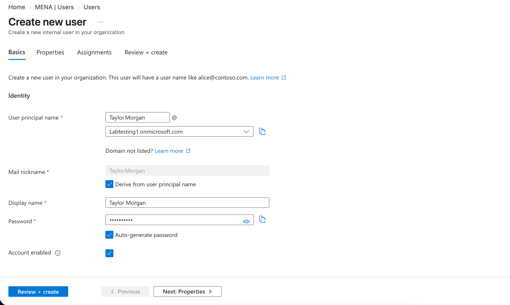
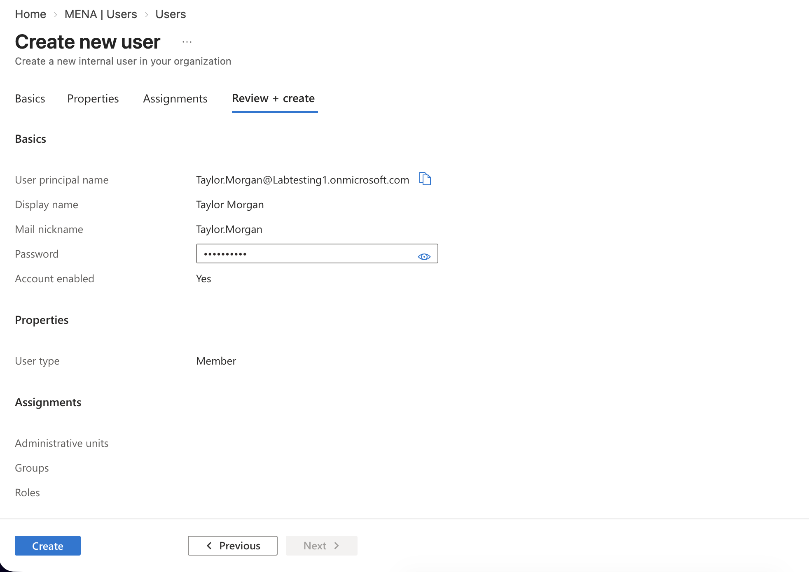
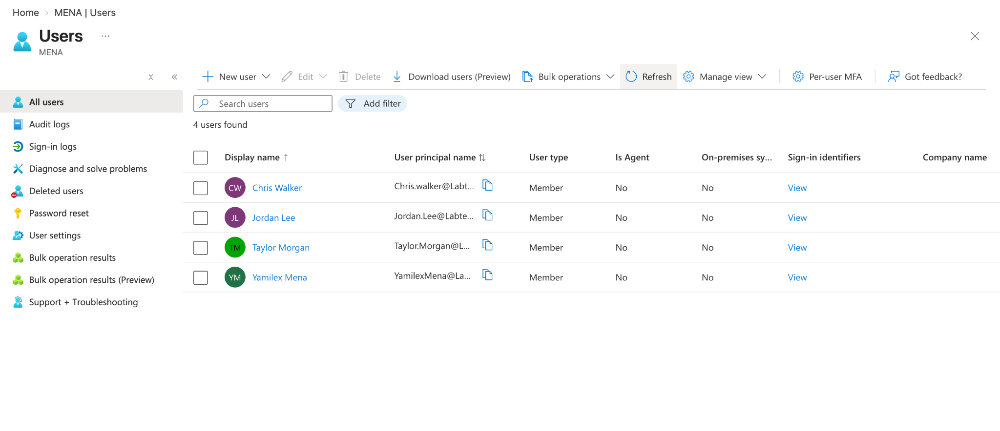

# Creating Users in Microsoft Entra ID

## Objective

Create and verify a new user account in Microsoft Entra ID to practice cloud identity provisioning and user administration.

## Step 1: Create a New User

Created a test user account and configured the user principal name, display name, account status, and user type.

## Step 2: Review the User Configuration

Reviewed the account information before provisioning the user.

## Step 3: Verify the User Was Created

Confirmed that **Taylor Morgan** was successfully added to the Microsoft Entra ID tenant.

## Skills Demonstrated

- Microsoft Entra ID
- User Provisioning
- Identity and Access Management
- User Administration
- Account Verification
